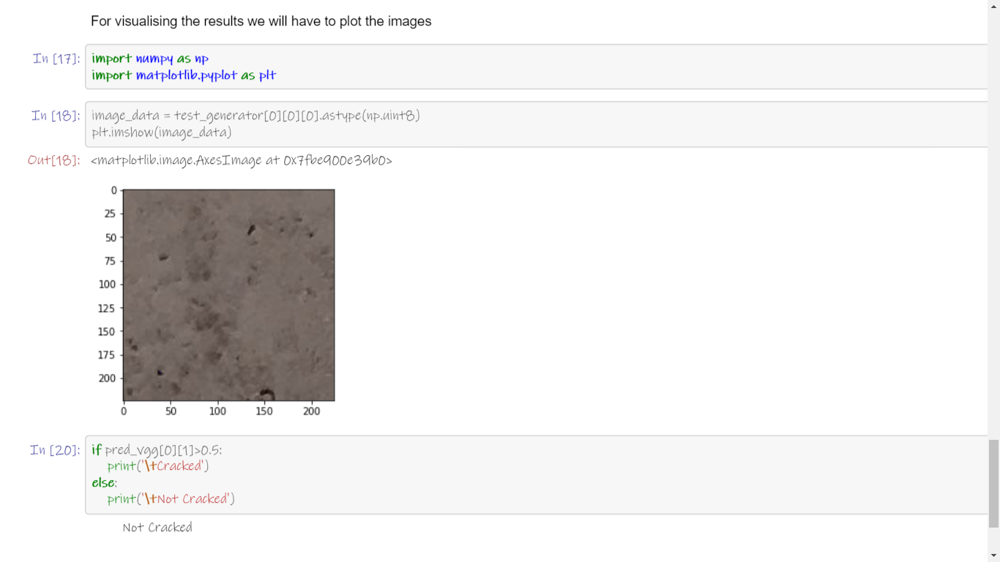

# Detecting_Cracks_In_Buildings

 

In the notebook provided above, I've built an image classification Deep Learning model using VGG16 pretrained model in Keras, which can detect cracks in the images of buildings.

### Thanks for Reading!
